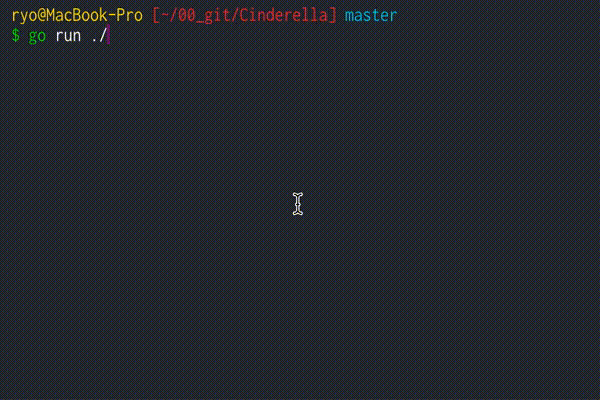

# Cinderella Story
From Wikipedia
[シンデレラ - Wikipedia](https://ja.wikipedia.org/wiki/%E3%82%B7%E3%83%B3%E3%83%87%E3%83%AC%E3%83%A9)




# Dependency
- MacOSX Mojave 10.14.1
- Golang 1.11.1

The operation is unconfirmed except the above environment.

# Useage

## Clone
```
$ git clone https://github.com/lboavde1121/cinderella.git
```

## Run
```
go run ./
```
Installing dependency packages is unnecessary because using Go Modules.